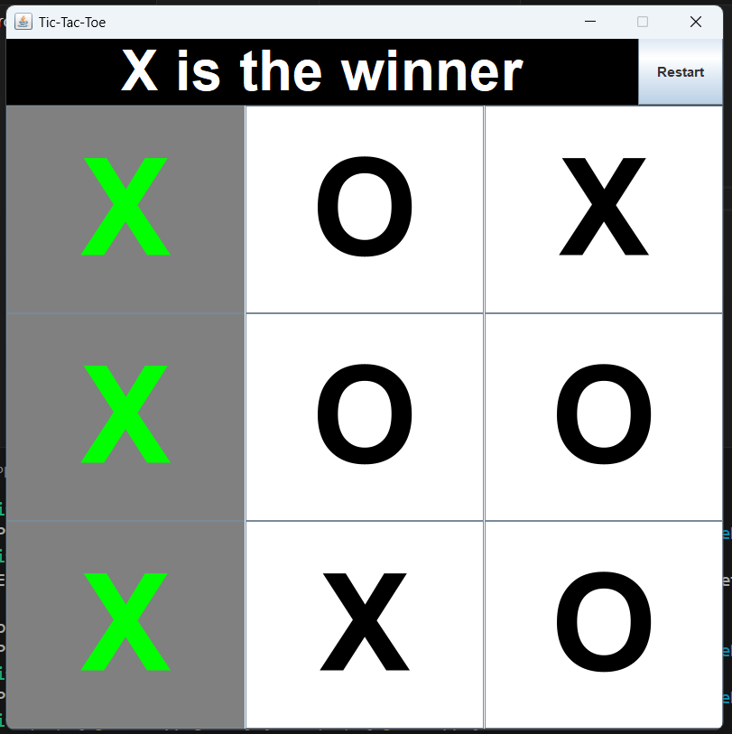

# 🎮 Tic Tac Toe - Java Swing Edition

A simple and interactive **Tic Tac Toe** game built using **Java Swing GUI** components.  
This project allows two players to play Tic Tac Toe on a 3x3 board with a graphical interface.

---

## 📌 Features

- 🎯 2-player mode
- ✅ Winner detection (horizontal, vertical, diagonal)
- 🔁 Restart game option
- 🎨 Simple and clean GUI
- 📋 Tie detection
- 💡 Responsive turn indicator

---

## 🖼️ Screenshot




## 🧰 Tech Stack

- Java (JDK 8+)
- Java Swing (GUI Framework)
- AWT (Event Handling)

---

## 🚀 How to Run

### 💻 Prerequisites:
- Java installed (JDK 8 or higher)
- A code editor (e.g. IntelliJ IDEA, Eclipse, VS Code)

### 🏃 Steps:
1. Clone the repository:

```bash
git clone https://github.com/YOUR_USERNAME/TicTacToe-Java.git
cd TicTacToe-Java
